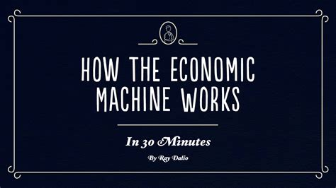
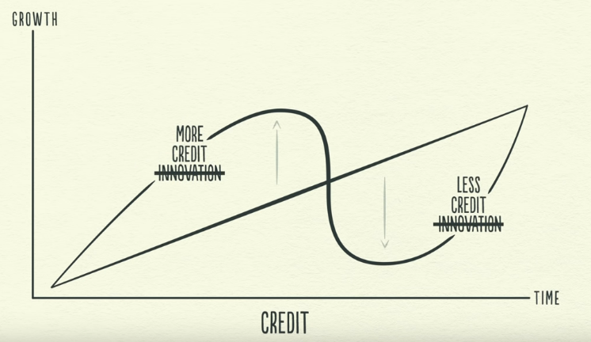
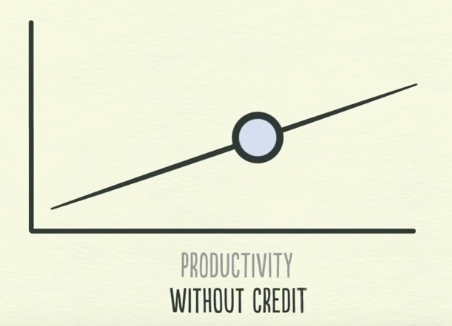
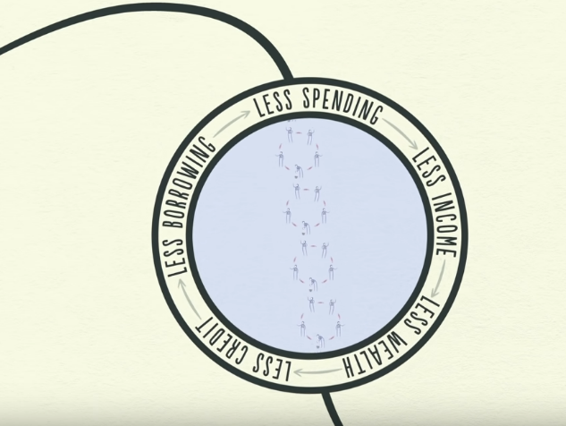
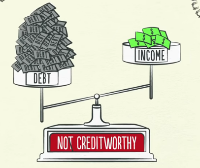
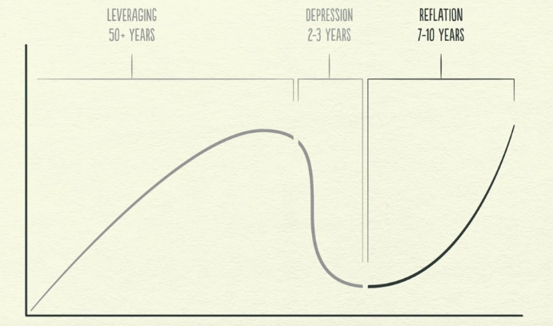

# Table of Contents

1. [Introduction](#intro)
2. [Transactions](#transactions)
3. [Credit](#credit)
4. [Credit vs productivity](#credit-v-productivity)
5. [Short-term debt cycle](#short-term)
6. [Long-term debt cycle](#long-term)
7. [De-leveraging](#deleveraging)
   1. [Austerity](#austerity)
   2. [Reduced Debts](#reduced-debts)
   3. [Redistribution of wealth](#wealth-redistribution)
   4. [Money Printing](#money-printing)
8. [CRITIC](#video-criticism-from-external-sources)
9. [Austrian Economics Reference Materials](#austrian-economics-ref)

# Introduction

3 things that drive the economy:

- productivity growth
- short-term debt cycle
- long-term debt cycle

# Transactions

- exchange of money(or credit, or money+credit) with a seller for goods/services/financial assets
- total spending - sum of credit and money, drives economy.
  - ratio of total spending to total quantity sold = price.
- market - transactions for the exact same thing
  - for instance, wheat market, car market, stock market, etc.
- biggest transaction maker(buyer and seller) - central bank and central government of a nation.
  - central bank controls total monetary flow by controlling interest rates and printing new money.

# Credit

- credit of borrower  = increased spending = total spending of a country increases, thus driving the economy.
- this increased spending is somebody's increased income, hence more borrowing further(since income is high, more creditworthy) , which increases spending, and the cycle continues.
- this spending depends upon the quality of produce, i.e. productivity.
  - if productivity is not high(either volume or quality) then spending is not much, thus economy might stagnate.
- high productivity ==> more selling ==> more income ==> more creditworthy ===> higher living standards.
- productivity matters most in the long run, while credit matters most in the short run = ?
  - this is because productivity is a long-term phenomenon.
  - but lending is  a short term one, hence debt is the one that actually drives the economy.

# Credit vs productivity

- 
- Find how GDP is measured!!!
  - is growth, economic activity, GDP and productivity the same?
- these swings around the line, called long term debt cycle, are driven by credit **and not innovation**.
- for an economy based solely on productivity
  
  - hence, increased income depends on being more productive, which will drive increased spending as well.
  - thus, an increased productivity of one, will drive my increased spending, which will drive someone's income, which will be due to their increased productivity, thus driving their spending up and so on.
  - this is represented in the linear productivity growth linewhy is the productivity growth line always assumed to be linear in nature?
- borrowing instantly calls for a cycle since currently you have more money than you should, thus later, while paying back that money, you will have lesser money than you earn.
- money in the USA - \$50T, total money in circulation - \$3T
- an economy without credit will move forward only if its productivity increases, but an economy with credit can have an increased spending when the credit increases too(without an increase in the productivity).

# Short-term debt cycle

- 
- prices rise when amount of (income + credit) exceeds the production of goods - inflation.
- this is combated by allowing lesser credit to be borrowed, and this is where central bank steps in, to increase interest rates, thus preventing too many people from availing credit.
- this causes lesser spending, due to less total money(income+credit, with credit going down), thus one person's spending is another's income, incomes drop.
  - this finally decreases the price, since supply demand have readjusted themselves.
  - this is called deflation, or the trough in the graph of the short-term debt cycle.
  - to prevent an increased trough, interest rates are dropped once again, that drives the economy and creates the crest in the graph.
- typically lasts 5-8 years.
  - why is it this long? because of the usual credit being this long? for instance home and car loans? 
    - these are usually EMIs, hence would they amount to this cyclical nature of growth? 
    - do credit cards amount to this? since credit card is anyways a carry-forward type of credit, never-ending theoretically
  - do retail loans cause this graph or institutional loans or both?
- theoretically, the trough/crest of the n'th cycle should be higher than the trough/crest of the n-1'th cycle
  - the supporting argument is the human nature, of borrow and spend more than repay back.
  - this also means that n'th debt > n-1'th debt.
  - what would be the case if human nature is removed?
    - would it be all successive crests/troughs are the same?
    - what would it even mean to have the n'th crest/trough be lower than the n-1'th crest/trough
  - this makes the debt rise more than the incomes, thus creating the **long-term debt cycle**.

# Long-term debt cycle

- debt burden: debt to income ratio
  - if increase in both goes hand in hand, ratio remains stable.
- as spending(debt) increases, asset values also increase, more credit is availed to buy them, thus an environment of economic prosperity is seen.
- slowly debt-burden increases, causing repayments to increase.
  - this cuts back spending, and spending of person-1 = income of person-2 , incomes fall, so does spending , which makes them less credit worthy, hence lesser credit can be sought by person-2.
  - this creates the long-term debt cycle peak.
- this begins the deleveraging phase of the economy.

# De-leveraging

- spending is cut ===> incomes fall ===> asset prices drop ===> stock market crashes ===> banks get squeezed.

- borrowers become less creditworthy(due to bank squeeze, banks raise the bar high up), hence don't have money to repay previous debt, and thus are forced to sell assets.

- this selling rush causes stock/real-estate market crashes, 

  - since spending is cut, assets have to be offered at a lower price, this lower price manifests itself in the form of market crash.
  - this means asset-prices are falling.

- as asset prices fall, the value of collateral submitted by the borrower decreases, thus making the borrowers even less creditworthy.
  

- interest rates were already lowered during recession, hence cannot go any further below.

  - for instance, in the USA, these hit rock-bottom = 0% in 1930s and 2008.

- deleveraging differs from recession in the fact that the borrower's debt has **simply gotten too much out of hand**.

- 

- 4 ways that deleveraging could be taken care of

  - cut spending
  - reduce debts via defaulting and re-structuring of debt.
  - wealth re-distribution from the *haves* to the *have-nots*
  - central bank money printing.
  - these 4 ways happened in USA-1930, England-1950s, Japan-1990s and Spain-n-Italy - 2010s

- ## Austerity

  - stop taking new credit, pay back existing one.
  - this might seem to decrease the debt burden, but the opposite happens, as person-1's spending = person-2's income.
    - hence, incomes fall, increasing the debt-burden.
    - meanwhile the debt repayment rate is lesser than the decremental rate of incomes, thus worsening the debt-burden.
    - since payback ensues, spending decreases, assets due to low demands fall in prices, hence this form of deleveraging is deflationary.

- ## Reduced Debts

  - banks function on deposits from citizens, hence if banks do not receive credit payments, they cannot give back deposits.
  - a bank run starts as depositors start to feel this panic, hence banks and borrowers default.
  - this phase is called a depression.
  - debt restructuring thus happens in order to prevent a further fall in value of certain assets.
  - this means the lender(banks) will agree to getting paid back less, or stretching the time period of repayment or at a lower interest rate.
  - this make it seem like the debt is reduced, but also causes the incomes to go down even faster, thus worsening the debt-burden once again.
  - hence, this form of deleveraging is deflationary.

- ## Redistribution of wealth

  - lower incomes and less employment ==> less tax collections, thus impacting the government.
  - since unemployment has increased, government needs to employ more people, thus has to increase its spending.
    - since many of the unemployed have inadequate liquid savings and need financial support from the government.
    - at the same time, governments create stimulus plans to make up for the decrease in the economy(*stimulate*)
  - this decreased income(via taxes) and increased spending causes their budget deficit to explode.
  - to balance this out, either raise taxes, or borrow money.
  - The tax is raised on the wealthy, thus facilitating a re-distribution of wealth in the economy.
  - this can only support to an extent, and when the rich start to resent the demands of the poor, social unrest ensues, and the only way to tackle this is via central bank money printer.
  - hence, this form of deleveraging is deflationary.

- ## Money Printing

  - this is the only method that is inflationary in nature.
  - money printed is used to buy financial assets and government bonds.
  - this raises asset prices, thus making asset holders creditworthy.
  - for people not holding any financial assets, the central government is the one to issue money via an exchange for goods and services.
  - by buying government bonds, the central bank issues credit to the government, thus the government has enough money to increase spending on goods and services through stimulus packages and unemployment benefits.
  - this increases people's income but also the government's debt.
  -  

- the 3 deflationary ways have to be balanced with the only inflationary way, by the central government.

- the central bank and the central government have to work in tandem for a graceful deleveraging, in order to cut down debt and at the same time increase money supply , i.e. income.

  - this will cause the debt-burden to relax.

- an example of **graceless deleveraging** was **Germany in the 1920s**.

  - money printing was too much, and other methods of relaxing the debt-burden were infrequently used.

- money supply increase ===> incomes rise ===> borrowers become more creditworthy ===> lending increases ===> spending increases ===> incomes rise ===> cycle continued.

- 

  - since **reflation** takes about 10 years , this period is called *the lost decade*.

# CRITIC

- this is according to the *Modern Monetary Theory* , but the ***Austrian Economics*** which would be VERY critical of this explanation.

# Austrian Economics Reference Materials

- [First is important to understand the modern use of the word "inflation" and the nonsense behind it](https://www.youtube.com/watch?v=K0VKzNtZupA) 
- [Shiff applying the theory in the last crises while mainstream economists were laughing at him](https://www.youtube.com/watch?v=sgRGBNekFIw), 
  - btw in books/writtings is possible to find austrians calling for every single significant crisis so far.
- [Explanation with good details about the theory](https://www.youtube.com/watch?v=trHlLzKWZ3Q) 
- Tom Woods Podcasts with plenty of interesting interviews and Bob Murphy (for more advanced details in economics). 
  - A few topics that could be helpful: 
  - [https://tomwoods.com/ep-1894-why-the-economy-goes-up-and-down-explained-for-a-teenager-a-5-year-old-and-a-grad-stduent/](https://www.youtube.com/redirect?event=comments&redir_token=QUFFLUhqbTFzdGtuUzJvbXFkYTFZQXIzZkZlekN5QW1RZ3xBQ3Jtc0ttNjgzU0tWcWloeWVjRnpzbEdCVTdkYTFfOHZya3M1YXhjenBLU0lfZWF0X1NucUFjdkpOQWc1Uy1XVGRXY2ZKc2N6VjVoVXRNVHhMVHg4dGdBaENrUUNhSkYzWkJTTmhCYnBzYmZreFBBU3F1YU9UVQ&q=https%3A%2F%2Ftomwoods.com%2Fep-1894-why-the-economy-goes-up-and-down-explained-for-a-teenager-a-5-year-old-and-a-grad-stduent%2F&stzid=Ugz0WTQIK2v3NXVVKI54AaABAg.9N0FXXYeo9F9OXVoaUJ5f5) 
  - [https://tomwoods.com/ep-419-austrian-business-cycle-theory-answering-the-critics/](https://www.youtube.com/redirect?event=comments&redir_token=QUFFLUhqbGd6dUpfVmEwcHVBOGtzVDRmQWV1S1BvRWZMUXxBQ3Jtc0tra0RCU1NWbllLWTFQTEpFbnNyaUhNanRhSHExUm5DdDI2MWtVWlBLbHJhR0hoNDBNWEZ1MUNqa1pldWFIV0lsM2lEeHFJUEd0UVZTZXY3OW5MbGdEbzhiTjdOU2xBc1dobUxHWm1YWW1sUHhIRUlOYw&q=https%3A%2F%2Ftomwoods.com%2Fep-419-austrian-business-cycle-theory-answering-the-critics%2F&stzid=Ugz0WTQIK2v3NXVVKI54AaABAg.9N0FXXYeo9F9OXVoaUJ5f5)
  - [https://tomwoods.com/ep-1214-how-austrian-school-economists-predicted-the-major-economic-crises/](https://www.youtube.com/redirect?event=comments&redir_token=QUFFLUhqa29oX1JCci1iUDd4bFlMQ09hU1BJUEdTSzFiUXxBQ3Jtc0tsUElSZHpQSjJ5QWFJTlh5c1dFbXc0SjM2MFlPSDBnS2w0SmRnYnhfQ1B6dXVKSUt6UXdSM1Y1YktUWEJkYlZxM0tOQlIxeUR1eFlUYWo3eExsbnJJeTBMVEE4cnV0dU8zdWtsbEg3S0sxTHlmdkx1TQ&q=https%3A%2F%2Ftomwoods.com%2Fep-1214-how-austrian-school-economists-predicted-the-major-economic-crises%2F&stzid=Ugz0WTQIK2v3NXVVKI54AaABAg.9N0FXXYeo9F9OXVoaUJ5f5)
  - [https://tomwoods.com/ep-723-austrian-criticisms-of-mainstream-economics-are-sound-reply-to-a-critic/](https://www.youtube.com/redirect?event=comments&redir_token=QUFFLUhqbTVnc1hiY3pTUE02Tmp6ODRJYTVjZmdUeGxhZ3xBQ3Jtc0trNWxMUHMzeHNHQWVWN1Z0OFZxekxoV05UempBVUVmMnRvZXVXd01qNVZweDN6d2NfOC0xVzBDSmtRYnVCaFFHZndDUENrdDI5VVVwRzMtMHVCNnBPNUNFUXRYODA1X0I0UEJDZkswZkZseEVqM1dGUQ&q=https%3A%2F%2Ftomwoods.com%2Fep-723-austrian-criticisms-of-mainstream-economics-are-sound-reply-to-a-critic%2F&stzid=Ugz0WTQIK2v3NXVVKI54AaABAg.9N0FXXYeo9F9OXVoaUJ5f5) 
  - [https://tomwoods.com/ep-655-economist-goes-very-wrong-on-business-cycles-we-correct-him/](https://www.youtube.com/redirect?event=comments&redir_token=QUFFLUhqbXRVckU1Y2Z0cy1NMWpheUZwNHowaUJEMjFad3xBQ3Jtc0trS2hEbmtIZTVuOFRSNnFoeHI5MWlOR0JDOTYzdnk4dllxWFE3WmRpaXRXWlJ4U0k0QjR6VWtqZUxsSl9DUmEzSDZyM3NzalRFczd3eWtkVEFkZWZydjRtQnp6Y3NPSUQzUkhSRWEtRHV0Zl80OS1pdw&q=https%3A%2F%2Ftomwoods.com%2Fep-655-economist-goes-very-wrong-on-business-cycles-we-correct-him%2F&stzid=Ugz0WTQIK2v3NXVVKI54AaABAg.9N0FXXYeo9F9OXVoaUJ5f5) 
  - [https://tomwoods.com/ep-367-murphy-takes-on-krugman-on-recessions-business-cycles/](https://www.youtube.com/redirect?event=comments&redir_token=QUFFLUhqa3p6eHJ5Y0pzdTY5RTVqRE1yUHBaamRqaFBtd3xBQ3Jtc0trQ21GTURKdV9JaVpWTjkxU190RUR2Zlczak9QWTYxeEpFOXoyMEd0RnJ4UkNscWRNOWJVdk9rWWNkN1NKSVQxMG9GczQ0eWFGXzJnQ2dJbUtBNm5lT3RNSEowV25UNHlmUWVlUXNFdVhWT0RSejNpZw&q=https%3A%2F%2Ftomwoods.com%2Fep-367-murphy-takes-on-krugman-on-recessions-business-cycles%2F&stzid=Ugz0WTQIK2v3NXVVKI54AaABAg.9N0FXXYeo9F9OXVoaUJ5f5) 
  - [https://www.bobmurphyshow.com/episodes/ep-56-bob-murphy-explains-austrian-business-cycle-theory-the-inverted-yield-curve/](https://www.youtube.com/redirect?event=comments&redir_token=QUFFLUhqbjdoQUJKLTd5Y1ZMQ2VUMnhTZDNlMndLcDc0UXxBQ3Jtc0treHVSMTU4MDR5eGlVYVFFYVZZdXhrWWNuMUgtakpnT0RwcHZpWjNSblpZcGpzdGNUakpPMC1Jd2xDNmVfMmp3NUFsQmMyYnQ0b283ajhyYzY2NlZQUzZ5MFVRUUEwY0NUMlpYYTVCdmxCTWpONWZIZw&q=https%3A%2F%2Fwww.bobmurphyshow.com%2Fepisodes%2Fep-56-bob-murphy-explains-austrian-business-cycle-theory-the-inverted-yield-curve%2F&stzid=Ugz0WTQIK2v3NXVVKI54AaABAg.9N0FXXYeo9F9OXVoaUJ5f5) 
- [America's great depression - Murray Rothbard](https://www.amazon.com/Americas-Great-Depression-Murray-Rothbard/dp/0945466056). 
- [Money, bank and credit - Jesus Huerta de Soto](https://www.amazon.com/Money-Bank-Credit-Economic-Cycles/dp/1933550392). 
- [Economic Depressions: Their Cause and Cure from Rothbard](https://www.amazon.com/Economic-Depressions-Their-Cause-Cure-ebook/dp/B005CR8E7C)
  - is a fast reading that would be ideal to start, I guess.